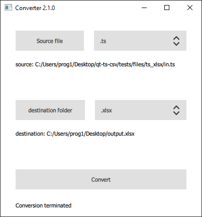
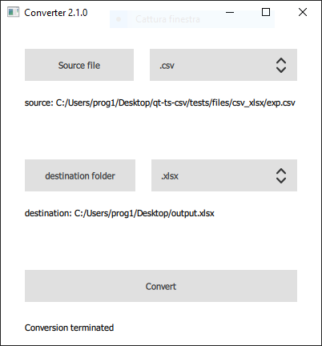
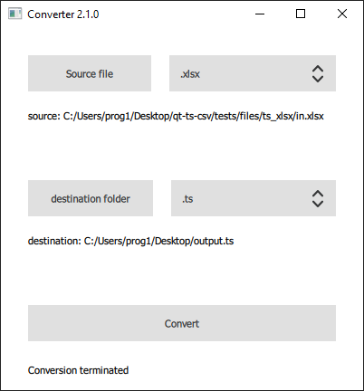

[](https://travis-ci.org/guerinoni/qt-ts-csv)

# qt-ts-csv
A tool to generate csv and xlsx file from qt ts file and vice versa

## command line mode
to execute qt-ts-csv withoud gui:
~~~
qt-ts-csv --cli /path/to/input/file /path/to/output/file
~~~
one of those extensions are required in the file names: .csv .ts .xlsx

## Build
~~~
sudo apt install qt5-default qml-module-qtquick-controls2 qtdeclarative5-dev qml-module-qt-labs-platform qml-module-qtquick-dialogs qml-module-qtquick-layouts
git clone --recursive https://github.com/guerinoni/qt-ts-csv.git
mkdir build-qt-ts-csv
cd build-qt-ts-csv
qmake ../qt-ts-csv/qt-linguist-to-csv.pro -spec linux-g++ CONFIG+=qtquickcompiler
make
~~~

## Usage

### To generate output.csv  
  

### To generate output.xlsx  
  



### To generate output.ts  
  




### How to use windeployqt  

qmldir must be the directory where there are qml files
```
your\path\to\your\qt\compiler\bin\windeployqt.exe --no-translations --qmldir=your\path\to\qt-ts-csv\src your\path\to\build-qt-ts-csv\src\release  
```
#### Example:  
```
C:\Qt\5.12.1\mingw73_64\bin\windeployqt.exe --no-translations --qmldir=C:\Users\prog1\Desktop\qt-ts-csv\src C:\Users\prog1\Desktop\build-qt-ts-csv\src\release  
```
